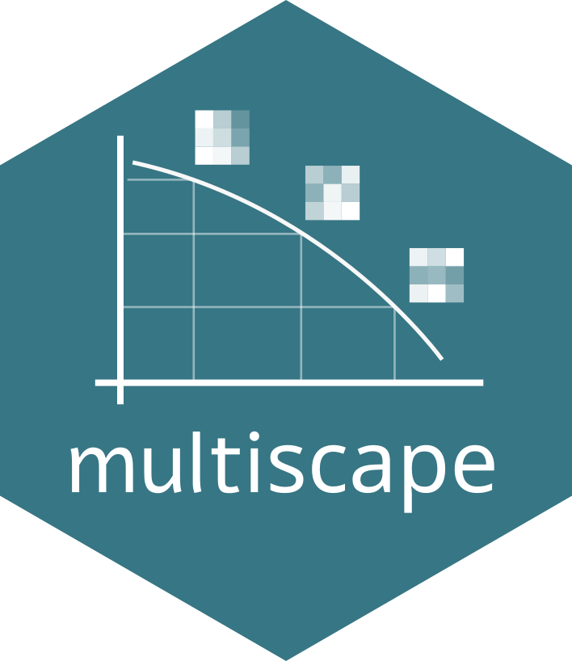

<!-- README.md is generated from README.Rmd. Please edit that file -->

```{r setup, include = FALSE}
knitr::opts_chunk$set(
  collapse = TRUE,
  comment = "#>",
  fig.path = "man/figures/README-",
  out.width = "100%"
)
```

# multiscape: Multi-objective spatial planning in R 

<!-- badges: start -->
[](https://lifecycle.r-lib.org/articles/stages.html)
[](https://github.com/josesalgr/multiscape/actions/workflows/R-CMD-check.yaml)
<!-- badges: end -->

## Overview

`multiscape` is an exact optimisation framework for **multi-objective spatial planning** in R. It is designed for planning problems in which spatial data, ecological or socioeconomic features, constraints, and multiple competing objectives must be considered simultaneously within a single decision-support workflow. The package is built around **mixed-integer linear programming (MILP)** formulations, allowing users to represent spatial planning problems explicitly as optimisation models and solve them with exact methods. This makes `multiscape` especially suitable for applications where transparent model structure, reproducibility, and rigorous trade-off analysis are important. `multiscape` supports both general spatial planning formulations and action-based formulations in which decisions are expressed as **management actions** applied across planning units. With it, users can build planning problems from tabular or spatial inputs, define feasible actions and their effects, add targets and other constraints, register multiple objectives such as cost, benefit, profit, or fragmentation, and explore exact trade-offs using multi-objective methods such as weighted-sum, epsilon-constraint, and AUGMECON.


## Installation

The current development version can be installed from GitHub:

```{r install, eval = FALSE}
if (!requireNamespace("remotes", quietly = TRUE)) {
  install.packages("remotes")
}

remotes::install_github("josesalgr/multiscape")
```

## Why `multiscape`?

`multiscape` brings together several key components of spatial planning in a single optimisation framework:

- **exact MILP-based modelling** for rigorous spatial decision support,
- **multi-objective optimisation** to analyse trade-offs instead of a single optimum,
- **spatially explicit formulations** with targets, constraints, and spatial relations,
- **flexible decision structures**, including both planning-unit and action-based formulations,
- and a **reproducible R workflow** for building and solving optimisation problems.

## Core workflow

A typical `multiscape` workflow has five steps.

First, the user creates a `Problem` object from planning units, features, and baseline feature amounts. Second, the user adds feasible actions and, when relevant, defines how those actions affect the features of interest. Third, the user adds targets, constraints, and spatial relations. Fourth, the user registers one or more atomic objectives. Finally, the user solves the problem in single-objective or multi-objective mode.

In other words, `multiscape` separates problem definition from optimization. The `Problem` object stores the planning specification, and the solving stage later translates that specification into one or more exact optimization runs.

## Multi-objective methods

`multiscape` currently supports several exact multi-objective workflows.

The **weighted-sum** method combines multiple registered objectives into a single scalar objective through user-defined weights. It is simple and useful for preference-driven exploration of trade-offs.

The **epsilon-constraint** method optimizes one objective directly while transforming the remaining objectives into explicit performance constraints. This is especially useful when one objective should be prioritised while the others are controlled through thresholds.

The **AUGMECON** method extends epsilon-constraint with an augmented formulation designed to reduce weakly efficient solutions and improve Pareto-front generation.

Together, these methods allow users to move beyond a single “best” solution and instead analyse sets of efficient trade-off solutions.

## Worked example

The example below illustrates a typical `multiscape` workflow using package data with polygon planning units stored as an `sf` object.

### Load the package and example data

```{r}
library(multiscape)

data("sim_pu_sf", package = "multiscape")
data("sim_features", package = "multiscape")
data("sim_dist_features", package = "multiscape")
```

The object `sim_pu_sf` contains planning-unit polygons and a `cost` column. The tables `sim_features` and `sim_dist_features` define the feature catalogue and the baseline distribution of feature amounts across planning units.

### Build the planning problem

```{r}
p <- create_problem(
  pu = sim_pu_sf,
  features = sim_features,
  dist_features = sim_dist_features,
  cost = "cost"
)

print(p)
```

At this stage, the problem contains the planning units, the feature definitions, the baseline feature amounts, and the spatial geometry that can later be used for spatial relations and visualisation.

### Add management actions

```{r}
actions <- data.frame(
  id = c("conservation", "restoration"),
  name = c("Conservation", "Restoration")
)

p <- add_actions(
  x = p,
  actions = actions,
  cost = c(conservation = 2, restoration = 6)
)

print(p)
```

This adds an action catalogue and creates the feasible planning unit–action table used later by the optimisation model.

### Add action effects

```{r}
effects_tbl <- expand.grid(
  action = c("conservation", "restoration"),
  feature = sim_features$name,
  stringsAsFactors = FALSE
)

effects_tbl$multiplier <- c(
  rep(0.05, nrow(sim_features)),
  rep(0.20, nrow(sim_features))
)

p <- add_effects(
  x = p,
  effects = effects_tbl,
  effect_type = "delta"
)
```

In this example, conservation produces a small positive effect on all features, whereas restoration produces a larger positive effect.

### Add a spatial relation

```{r}
p <- add_spatial_distance(
  x = p,
  name = "distance",
  max_distance = 1000
)

print(p)
```

This stores a spatial relation that can later be used by spatial objectives or diagnostics.

### Add a target

```{r}
p <- add_constraint_targets_relative(
  x = p,
  targets = 0.03
)

print(p)
```

This requires each feature to reach at least a specified proportion of its baseline total.

### Register atomic objectives

```{r}
p <- p |>
  add_objective_min_cost(alias = "cost") |>
  add_objective_max_benefit(alias = "benefit") |>
  add_objective_min_fragmentation(
    alias = "frag",
    relation_name = "distance"
  )

print(p)
```

A key idea in `multiscape` is that objectives are first registered as **atomic objectives** under user-defined aliases. These aliases can later be combined through a multi-objective method.

### Configure a multi-objective method

```{r}
p_mo <- set_method_weighted_sum(
  x = p,
  aliases = c("cost", "benefit", "frag"),
  weights = c(1, 1, 1),
  normalize_weights = TRUE
)
```

This stores the multi-objective configuration in the problem object but does not solve the problem yet.

### Configure the solver

```{r}
p_mo <- set_solver_cbc(
  x = p_mo,
  time_limit = 60,
  gap_limit = 0.01,
  verbose = TRUE
)
```

Solver settings are stored in the problem object and later used by `solve()`. Other solver wrappers such as `set_solver_gurobi()`, `set_solver_cplex()`, or `set_solver_symphony()` can also be used.

### Solve the problem

```{r eval = FALSE}
res <- solve(p_mo)
```

Depending on the selected workflow, `solve()` returns either a `Solution` object for a single-objective problem or a `SolutionSet` object for a multi-objective workflow.

### Inspect results

```{r eval = FALSE}
solution_actions <- get_actions(res)
head(solution_actions)
```

For multi-objective results, trade-offs across runs can be explored with:

```{r eval = FALSE}
plot_tradeoff(res)
```

and, when geometry is available, spatial outputs can be visualised with:

```{r eval = FALSE, warning=FALSE}
plot_spatial(res, what = "actions")
```

## Why this example matters

This example illustrates the main modelling logic of `multiscape`. The package is not limited to selecting planning units under a single objective. Instead, it can represent richer spatial planning problems in which costs, targets, ecological effects, and spatial structure interact, and in which users may want to compare multiple efficient solutions rather than a single optimum.

In particular, the package makes it possible to study trade-offs such as lower cost versus higher ecological benefit, higher benefit versus stronger spatial cohesion, or more compact solutions versus more flexible intervention patterns.

## Learn more

To explore the package further, see the function reference on the package website and the documentation of key functions such as `create_problem()`, `add_actions()`, `add_effects()`, `add_constraint_targets_relative()`, and `solve()`.

For multi-objective workflows, the most relevant functions are `set_method_weighted_sum()`, `set_method_epsilon_constraint()`, and `set_method_augmecon()`.

If you find a bug or want to suggest an improvement, please open an issue at:

<https://github.com/josesalgr/multiscape/issues>
