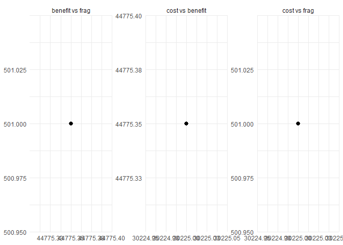
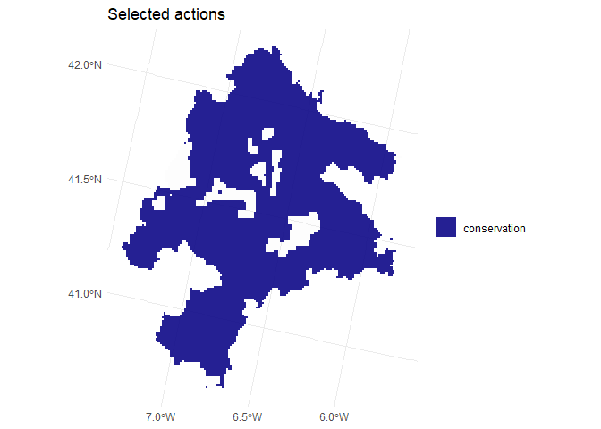

# Multi-Objective spatial planning in R

`multiscape` provides an exact optimisation framework for
**multi-objective spatial planning** in problems where decisions are
expressed as **management actions** applied across planning units.

The package allows users to:

- build planning problems from **tabular** or **spatial** inputs,
- define **feasible management actions** and their **action-specific
  effects** on features,
- add **constraints**, and **spatial relations**,
- register **atomic objectives** such as cost, benefit, profit, and
  fragmentation,
- and explore trade-offs using exact **multi-objective optimisation**
  methods such as weighted-sum, epsilon-constraint, and AUGMECON.

`multiscape` is designed for reproducible research workflows in
conservation planning, restoration planning, and other spatial
decision-support problems where actions, costs, ecological effects, and
spatial structure interact.

## Experimental status

`multiscape` is currently an experimental research package under active
development.  
The API may still evolve as the package moves toward a first stable CRAN
release.

## Installation

The current development version can be installed from GitHub:

``` r
if (!requireNamespace("remotes", quietly = TRUE)) {
  install.packages("remotes")
}

remotes::install_github("josesalgr/multiscape")
```

## Core workflow

A typical `multiscape` workflow has five steps:

1.  Build a `Problem` object from planning units, features, and baseline
    feature amounts.
2.  Add feasible actions and define how those actions affect features.
3.  Add constraints, and spatial relations if needed.
4.  Register one or more atomic objectives.
5.  Solve the problem in single-objective or multi-objective mode.

The example below illustrates this workflow using package data with
polygon planning units stored as an `sf` object.

## Worked example: spatial planning with actions and trade-offs

### Load the package and example data

``` r
library(multiscape)
#> 
#> S'està adjuntant el paquet: 'multiscape'
#> L'objecte següent està emmascarat per 'package:base':
#> 
#>     solve

data("sim_pu_sf", package = "multiscape")
data("sim_features", package = "multiscape")
data("sim_dist_features", package = "multiscape")
```

The dataset `sim_pu_sf` contains planning-unit polygons and a `cost`
column.  
The tables `sim_features` and `sim_dist_features` define the feature
catalogue and the baseline distribution of feature amounts across
planning units.

### Build the planning problem

``` r
p <- create_problem(
  pu = sim_pu_sf,
  features = sim_features,
  dist_features = sim_dist_features,
  cost = "cost"
)
#> Warning: The following pu's do not contain features: 8012 8033 8147 8263

print(p)
#> A multiscape object (<Problem>)
#> ├─data
#> │├─planning units: <tbl_df> (11109 total)
#> │├─costs: min: 1, max: 1
#> │└─features: 155 total ("ACCGENT", "ACCNISU", "ACRARUN", ...)
#> └─actions and effects
#> │├─actions: none
#> │├─feasible action pairs: none
#> │├─effect data: none
#> │└─profit data: none
#> └─spatial
#> │├─geometry: sf (11109 rows)
#> │├─coordinates: 11109 rows (x: 2868900..3007900, y: 2110700..2280700)
#> │└─relations: none
#> └─targets and constraints
#> │├─targets: none
#> │├─area constraints: none
#> │├─planning-unit locks: none
#> │└─action locks: none
#> └─model
#> │├─status: not built yet (will build in solve())
#> │├─objectives: none
#> │├─method: single-objective
#> │├─solver: not set (auto)
#> │└─checks: incomplete (no objective registered)
#> # ℹ Use `x$data` to inspect stored tables and model snapshots.
```

At this stage, the problem contains:

- planning units,
- features,
- baseline feature amounts,
- and spatial geometry that can later be used for plotting and spatial
  relations.

### Add management actions

We now define a simple action catalogue with two actions:

- `conservation`, representing low-cost maintenance actions,
- `restoration`, representing more intensive interventions.

``` r
actions <- data.frame(
  id = c("conservation", "restoration"),
  name = c("Conservation", "Restoration")
)

p <- add_actions(
  x = p,
  actions = actions,
  cost = c(conservation = 2, restoration = 6)
)

print(p)
#> A multiscape object (<Problem>)
#> ├─data
#> │├─planning units: <tbl_df> (11109 total)
#> │├─costs: min: 1, max: 1
#> │└─features: 155 total ("ACCGENT", "ACCNISU", "ACRARUN", ...)
#> └─actions and effects
#> │├─actions: 2 total ("Conservation", "Restoration")
#> │├─feasible action pairs: 22218 feasible rows
#> │├─action costs: min: 2, max: 6
#> │├─effect data: none
#> │└─profit data: none
#> └─spatial
#> │├─geometry: sf (11109 rows)
#> │├─coordinates: 11109 rows (x: 2868900..3007900, y: 2110700..2280700)
#> │└─relations: none
#> └─targets and constraints
#> │├─targets: none
#> │├─area constraints: none
#> │├─planning-unit locks: none
#> │└─action locks: none
#> └─model
#> │├─status: not built yet (will build in solve())
#> │├─objectives: none
#> │├─method: single-objective
#> │├─solver: not set (auto)
#> │└─checks: incomplete (no objective registered)
#> # ℹ Use `x$data` to inspect stored tables and model snapshots.
```

This creates the action catalogue in `p$data$actions` and the feasible
planning unit–action table in `p$data$dist_actions`.

### Add action effects

Next, we define how actions affect features. In this example, we use a
simple multiplier specification:

- `conservation` provides a small positive effect on all features,
- `restoration` provides a larger positive effect.

``` r
effects_tbl <- expand.grid(
  action = c("conservation", "restoration"),
  feature = sim_features$name,
  stringsAsFactors = FALSE
)

effects_tbl$multiplier <- c(
  rep(0.05, nrow(sim_features)),
  rep(0.20, nrow(sim_features))
)

p <- add_effects(
  x = p,
  effects = effects_tbl,
  effect_type = "delta"
)
```

Internally, effects are stored in canonical form with non-negative
`benefit` and `loss` columns for each `(pu, action, feature)` triple.

### Add a spatial relation

To represent spatial cohesion, we add a boundary-based spatial relation
from the planning-unit polygons:

``` r
p <- add_spatial_distance(
  x = p,
  name = "boundary",
  max_distance = 1000
)

print(p)
#> A multiscape object (<Problem>)
#> ├─data
#> │├─planning units: <tbl_df> (11109 total)
#> │├─costs: min: 1, max: 1
#> │└─features: 155 total ("ACCGENT", "ACCNISU", "ACRARUN", ...)
#> └─actions and effects
#> │├─actions: 2 total ("Conservation", "Restoration")
#> │├─feasible action pairs: 22218 feasible rows
#> │├─action costs: min: 2, max: 6
#> │├─effect data: 696042 rows
#> │├─effect mode: benefit only
#> │└─profit data: none
#> └─spatial
#> │├─geometry: sf (11109 rows)
#> │├─coordinates: 11109 rows (x: 2868900..3007900, y: 2110700..2280700)
#> │└─relations: boundary (21693 edges, w: 1..1)
#> └─targets and constraints
#> │├─targets: none
#> │├─area constraints: none
#> │├─planning-unit locks: none
#> │└─action locks: none
#> └─model
#> │├─status: not built yet (will build in solve())
#> │├─objectives: none
#> │├─method: single-objective
#> │├─solver: not set (auto)
#> │└─checks: incomplete (no objective registered)
#> # ℹ Use `x$data` to inspect stored tables and model snapshots.
```

This stores a spatial relation that can later be used by fragmentation
objectives.

### Add a target

We now add a relative target requiring each feature to reach at least
20% of its baseline total contribution:

``` r
p <- add_constraint_targets_relative(
  x = p,
  targets = 0.03
)

print(p)
#> A multiscape object (<Problem>)
#> ├─data
#> │├─planning units: <tbl_df> (11109 total)
#> │├─costs: min: 1, max: 1
#> │└─features: 155 total ("ACCGENT", "ACCNISU", "ACRARUN", ...)
#> └─actions and effects
#> │├─actions: 2 total ("Conservation", "Restoration")
#> │├─feasible action pairs: 22218 feasible rows
#> │├─action costs: min: 2, max: 6
#> │├─effect data: 696042 rows
#> │├─effect mode: benefit only
#> │└─profit data: none
#> └─spatial
#> │├─geometry: sf (11109 rows)
#> │├─coordinates: 11109 rows (x: 2868900..3007900, y: 2110700..2280700)
#> │└─relations: boundary (21693 edges, w: 1..1)
#> └─targets and constraints
#> │├─targets: 155 rows
#> │├─target preview: "ACCGENT" >= 108.2, "ACCNISU" >= 120.9, "ACRARUN" >= 15.33
#> │├─area constraints: none
#> │├─planning-unit locks: none
#> │└─action locks: none
#> └─model
#> │├─status: not built yet (will build in solve())
#> │├─objectives: none
#> │├─method: single-objective
#> │├─solver: not set (auto)
#> │└─checks: incomplete (no objective registered)
#> # ℹ Use `x$data` to inspect stored tables and model snapshots.
```

### Register atomic objectives

A key idea in `multiscape` is that objectives are registered as **atomic
objectives** under user-defined aliases. These aliases can later be
combined in multi-objective methods.

Here we register three objectives:

- minimise total cost,
- maximise ecological benefit,
- minimise fragmentation.

``` r
p <- p |>
  add_objective_min_cost(alias = "cost") |>
  add_objective_max_benefit(alias = "benefit") |>
  add_objective_min_fragmentation(
    alias = "frag",
    relation_name = "boundary"
  )

print(p)
#> A multiscape object (<Problem>)
#> ├─data
#> │├─planning units: <tbl_df> (11109 total)
#> │├─costs: min: 1, max: 1
#> │└─features: 155 total ("ACCGENT", "ACCNISU", "ACRARUN", ...)
#> └─actions and effects
#> │├─actions: 2 total ("Conservation", "Restoration")
#> │├─feasible action pairs: 22218 feasible rows
#> │├─action costs: min: 2, max: 6
#> │├─effect data: 696042 rows
#> │├─effect mode: benefit only
#> │└─profit data: none
#> └─spatial
#> │├─geometry: sf (11109 rows)
#> │├─coordinates: 11109 rows (x: 2868900..3007900, y: 2110700..2280700)
#> │└─relations: boundary (21693 edges, w: 1..1)
#> └─targets and constraints
#> │├─targets: 155 rows
#> │├─target preview: "ACCGENT" >= 108.2, "ACCNISU" >= 120.9, "ACRARUN" >= 15.33
#> │├─area constraints: none
#> │├─planning-unit locks: none
#> │└─action locks: none
#> └─model
#> │├─status: not built yet (will build in solve())
#> │├─objectives: 3 registered (benefit, cost, frag)
#> │├─method: not set
#> │├─solver: not set (auto)
#> │└─checks: incomplete (multiple objectives registered but no MO method
#> selected)
#> # ℹ Use `x$data` to inspect stored tables and model snapshots.
```

### Configure a multi-objective method

There are several ways to explore trade-offs in `multiscape`. A simple
option is to use a weighted-sum formulation.

``` r
p_mo <- set_method_weighted(
  x = p,
  aliases = c("cost", "benefit", "frag"),
  weights = c(1, 1, 1),
  normalize_weights = TRUE
)
```

This stores the multi-objective configuration in the problem object. It
does not solve the problem yet.

### Configure the solver

Before solving, we store solver settings in the problem object:

``` r
p_mo <- set_solver_cbc(
  x = p_mo,
  time_limit = 60,
  gap_limit = 0.01,
  verbose = TRUE
)
```

You can also use convenience wrappers such as
[`set_solver_gurobi()`](https://josesalgr.github.io/multiscape/reference/set_solver_gurobi.md),
[`set_solver_cplex()`](https://josesalgr.github.io/multiscape/reference/set_solver_cplex.md),
[`set_solver_cbc()`](https://josesalgr.github.io/multiscape/reference/set_solver_cbc.md),
or
[`set_solver_symphony()`](https://josesalgr.github.io/multiscape/reference/set_solver_symphony.md).

### Solve the problem

``` r
res <- solve(p_mo)
```

Depending on the selected method,
[`solve()`](https://josesalgr.github.io/multiscape/reference/solve.md)
returns either:

- a `Solution` object for a single-objective solve, or
- a `SolutionSet` object for a multi-objective workflow.

### Inspect results

For solved problems, `multiscape` provides helper functions to extract
user-facing summaries:

``` r
solution_actions <- get_actions(res)
head(solution_actions)
#>       pu       action cost status selected run_id
#> 1      1 conservation    2      0        1      1
#> 11110  1  restoration    6      0        0      1
#> 2      2 conservation    2      0        1      1
#> 11111  2  restoration    6      0        0      1
#> 3      3 conservation    2      0        1      1
#> 11112  3  restoration    6      0        0      1
```

When the result is a multi-objective solution set, you can also inspect
trade-offs across runs:

``` r
plot_tradeoff(res)
```



and, when geometry is available, spatial outputs can be visualised
directly:

``` r
plot_spatial(res, what = "actions")
```



## Why this example matters

This example illustrates the main modelling logic of `multiscape`.

The problem is not only about selecting planning units. Instead, it is
about deciding **which action** should be feasible and selected in each
planning unit, while accounting for:

- implementation cost,
- action-specific ecological effects,
- target achievement,
- and spatial cohesion.

This makes it possible to study realistic trade-offs such as:

- lower cost versus higher ecological benefit,
- greater benefit versus more compact spatial patterns,
- or more cohesive solutions versus more flexible action allocation.

## Learn more

To explore the package further, see:

- the function reference at the package website,
- the documentation of
  [`create_problem()`](https://josesalgr.github.io/multiscape/reference/create_problem.md),
  [`add_actions()`](https://josesalgr.github.io/multiscape/reference/add_actions.md),
  [`add_effects()`](https://josesalgr.github.io/multiscape/reference/add_effects.md),
  and
  [`solve()`](https://josesalgr.github.io/multiscape/reference/solve.md),
- and the multi-objective methods
  [`set_method_weighted()`](https://josesalgr.github.io/multiscape/reference/set_method_weighted.md),
  [`set_method_epsilon_constraint()`](https://josesalgr.github.io/multiscape/reference/set_method_epsilon_constraint.md),
  and
  [`set_method_augmecon()`](https://josesalgr.github.io/multiscape/reference/set_method_augmecon.md).

If you find a bug or want to suggest an improvement, please open an
issue at:

<https://github.com/josesalgr/multiscape/issues>
